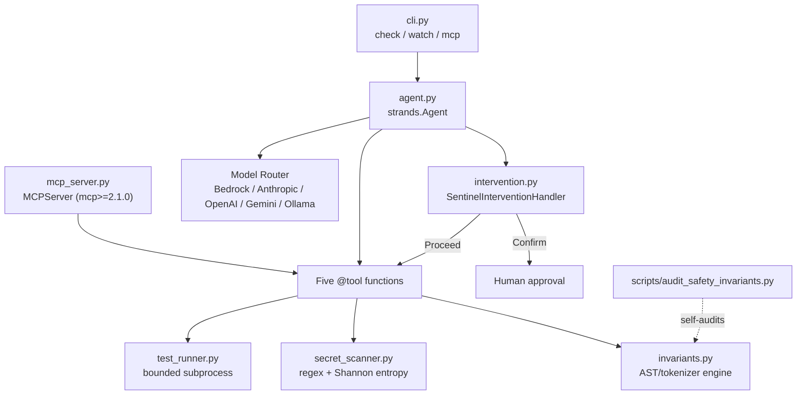

# strands-sentinel

Autonomous mission-critical systems and AST safety auditor built with the
[Strands Agents SDK](https://github.com/strands-agents/sdk-python) and the
Model Context Protocol (MCP). Built for the AWS "Agents for Humans
Hackathon" ($40,000 prize pool, Devpost).

strands-sentinel wires a Strands `Agent` to five deterministic audit tools
(AST safety invariants, secret scanning, sandboxed test execution, and
remediation guidance) behind an `InterventionHandler` that requires human
confirmation before any remediation action runs. Every finding traces back
to a real AST node, regex match, or subprocess result -- nothing is
inferred by the model and reported as fact.

## Architecture



## Quickstart

```bash
uv venv .venv --python python3.12
uv pip install --python .venv/bin/python3 -e ".[dev]"

# One-shot audit of a path, prints a Rich report, exits 1 on any CRITICAL finding
.venv/bin/strands-sentinel check src/strands_sentinel

# Re-audit on every .py file change (bounded via --max-iterations for CI/tests)
.venv/bin/strands-sentinel watch src/strands_sentinel --interval 2

# Run as an MCP server over stdio (Claude Code CLI, Antigravity, Bedrock AgentCore)
.venv/bin/strands-sentinel mcp
```

Model provider is selected by `STRANDS_SENTINEL_MODEL_PROVIDER`, or
inferred from `ANTHROPIC_API_KEY` / `OPENAI_API_KEY` / `GOOGLE_API_KEY` /
`OLLAMA_HOST`, defaulting to Bedrock (the only provider whose client
library -- `boto3` -- ships as a `strands-agents` transitive dependency and
is therefore the only one exercised end to end by this test suite; the
other four fail fast with an actionable install message when their client
library is missing, rather than shipping an untested code path).

## What it checks

- **AST safety invariants** (`invariants.py`), a practical subset of
  Gerard J. Holzmann's Power of 10 rules: function length (<=60 lines),
  assertion density (>=2 `assert` per function), bounded loops (`while
  True` without a statically reachable `break` is CRITICAL, with a break is
  WARNING since runtime boundedness still isn't provable), mutable default
  arguments, and banned dynamic-execution/deserialization calls (`eval`,
  `exec`, `os.system`, `pickle.load(s)`, `yaml.load`). Python is handled by
  full `ast` analysis; Rust/TypeScript/JavaScript/Go/C/C++ get a
  brace-counting length heuristic.
- **Secrets** (`secret_scanner.py`): deterministic regex matches (AWS
  access keys, GitHub PATs, EVM private keys, 12/24-word mnemonic-shaped
  phrases) reported at CRITICAL, plus a Shannon-entropy (H >= 3.8) catch-all
  for everything else reported at WARNING. Findings are always redacted
  (`AKIA****...**OP`) before leaving the scanner -- raw secret values are
  never returned, printed, or logged.
- **Tests**: `test_runner.py` auto-detects `cargo test`, `pytest`, or `make
  test` from repository markers and runs the resolved command as a bounded
  subprocess (a real `list[str]` argv, never a shell string, so there is no
  command-injection surface), extracting structured per-test failures. The
  parsers are verified against real `pytest -q` and `cargo test` output
  captured in this environment, not an assumed format.

## Intervention policy

`SentinelInterventionHandler` overrides `before_tool_call`: the four
read-only audit tools always `Proceed()`; `generate_remediation_patch` (or
any tool call made while a CRITICAL finding is outstanding) requires
`Confirm(prompt=...)` -- human approval before anything that could act on a
finding. `Confirm` takes a `prompt` field, not `message`; this is the one
place this build corrected a wrong field name that had been assumed rather
than verified against the installed SDK.

## Quality gate

```bash
make lint             # ruff check + mypy --strict, 0 errors
make audit-invariants  # this repo's own scripts/audit_safety_invariants.py, 0 violations
make test              # pytest, 100% pass rate
make demo              # runs the CLI against this package's own src/
```

Measured on this repository (macOS arm64, Python 3.12.13, in `.venv`):

| Check | Result |
|---|---|
| Tests | 85 passed; 0.87-5.20s wall clock across repeated runs (no fixed number quoted -- see below) |
| `ruff check .` | 0 errors, 0 warnings (note: ruff has no `--strict` flag; `check` plus the `[tool.ruff.lint]` selection in `pyproject.toml` is the strictness knob) |
| `mypy --strict src/ scripts/` | 0 errors across 9 source files |
| `scripts/audit_safety_invariants.py` | 0 violations (src/ + scripts/, self-inclusive, 9 files) |
| Invariant scan, `src/` only (8 files, 1229 lines) | 13.6 ms, 0 violations |
| Secret scan, same 8 files | 2.6 ms, 0 CRITICAL, 7 WARNING (long identifier names crossing the entropy threshold -- the documented false-positive surface of the entropy tier, not the deterministic one) |

Repeated `pytest` runs measured: 1.91s, 5.16s, 5.20s, 1.10s, 0.87s, 0.88s
(same machine, no code changes between runs) -- quoted as a range rather
than a single number since the variance itself is real and worth being
honest about.

## Repository layout

```
src/strands_sentinel/
  invariants.py       AST/tokenizer Power of 10 engine
  secret_scanner.py   regex + entropy secret detection
  test_runner.py      bounded pytest/cargo/make executor
  intervention.py     SentinelInterventionHandler
  agent.py            tools + resilient model router + Agent factory
  mcp_server.py       MCPServer (mcp>=2.1.0) exposing the five tools
  cli.py              check / watch / mcp subcommands
scripts/audit_safety_invariants.py   standalone self-audit entry point
tests/                85 tests across 7 files
```

## Non-negotiable invariants

- Every function in `src/` has <=60 lines and >=2 `assert` statements,
  enforced by `scripts/audit_safety_invariants.py` against its own source.
- No emojis anywhere in source, docstrings, CLI output, or commit history.
- Commits are authored as `Ishant5436 <ishant.p@somaiya.edu>`.
